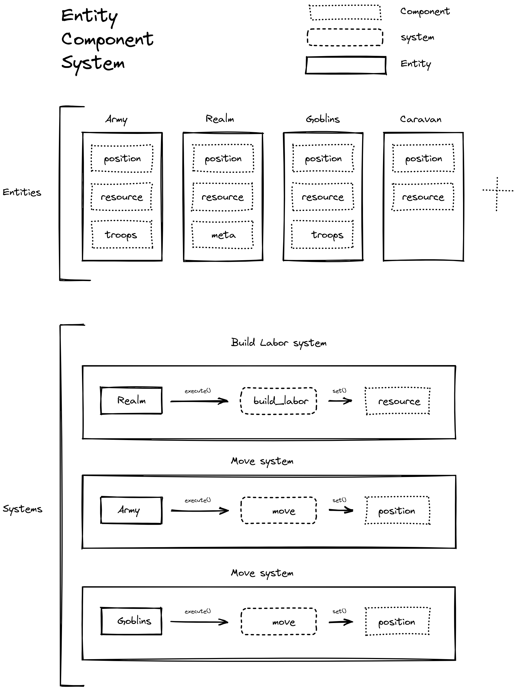

## Overview

Dojo employs the ECS (Entity Component System) as an architectural pattern to efficiently manage and organize the state and behavior of Autonomous Worlds (AWs). In this pattern, computation is defined as a list of systems operating on a set of entities, each of which consists of a dynamic set of pure data components. Systems select the entities to process via persistent and efficient queries over the entities' components.

It is worth reading this excellent [FAQ](https://github.com/SanderMertens/ecs-faq) on ECS

### Understanding the ECS in Dojo

The Entity Component System (ECS) forms the backbone of the Dojo engine. Here's an overview of its core elements:

1. **Entities**: Unique objects that can bear multiple components. They are identifiable through unique IDs.
2. **Components**: Diverse attributes of an entity, such as geometry, physics, and hit points. Components are exclusively responsible for data storage.
3. **Systems**: Segments of code that manage entities and alter components.
4. **Queries**: Utilized by systems to select entities based on the associated components.
5. **World**: A comprehensive container for entities, components, systems, and queries.

---

### Building an Autonomous World with Dojo

Follow these steps to effectively create a Dojo world:

1. **Conceptualize Entities**: Visualize the entities that will populate your world.
2. **Recognize Shared Attributes**: Determine common characteristics of your entities, such as position, name, or health.
3. **Construct Reusable Components**: Create versatile components derived from these shared attributes.
4. **Develop Specialized Systems**: Design systems that are adept at performing a specific task.

To illustrate, here's an example of a basic design that utilizes components and systems to create four distinct entities:

